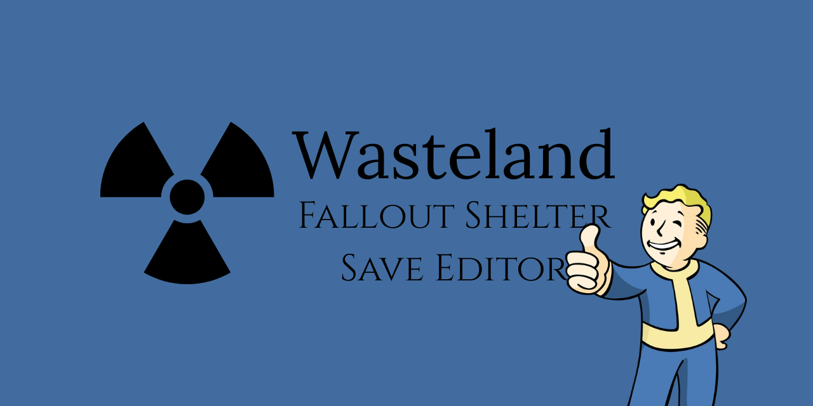

# Wasteland
Wasteland is a modern save editor for Fallout Shelter, designed to provide a user-friendly interface for editing game saves. It allows players to modify various aspects of their vault, including dwellers, items, and resources.

## Features
- Edit dweller attributes
  - Health
  - Happiness
  - Level
  - SPECIAL stats
  - Equipment (weapons, outfits, pets)
  - Appearance
  - Pregnancy
- Manage vault resources
  - Caps
  - Nuka Cola
  - Lunchboxes
  - Mr. Handies
  - Pet Carriers
  - Starter Packs
- Quick actions for common edits
  - Set all dwellers to super health
  - Set all dwellers to max happiness
  - Set all dwellers to max level
  - Set all dwellers to max SPECIAL stats
  - Remove all rocks
  - Unlock all rooms
  - Unlock all recipes
  - Revive all dead dwellers
- Import and export vault saves
  - Import .sav and .json files
  - Export to .sav and .json formats
- Backup and restore saves
- User-friendly interface with tabs for different sections

## How to Find Your Save File
- Windows: `Documents\My Games\Fallout Shelter`
- Windows Store: `%LOCALAPPDATA%\FalloutShelter`
- Steam: `C:\Users\YOURUSERNAME\AppData\Local\FalloutShelter`
- Android: `storage/sdcard/Android/data/com.bethsoft.falloutshelter/files`
